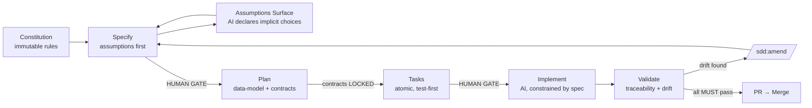

# Deiby Gorrin

**AI-First Software Engineer**

I ship production software with spec-driven AI workflows — human architecture, AI acceleration, everything measured.

&nbsp;

## What I Build

| Project | What it does | Stack | Commits | PRs |
|---------|-------------|-------|--------:|----:|
| WodRival _(private)_ | Competitive fitness platform — RPG progression, seasonal rankings, Norse mythology | Next.js, Supabase, Tailwind | 498 | 237 |
| [ClaudeStat](https://github.com/DeibyGS/claudestat) | Real-time monitor for AI dev sessions — cost, tokens, quota, MCP server. [npm](https://www.npmjs.com/package/@statforge/claudestat) | Node.js, TypeScript | 180 | 64 |
| Conductor _(private)_ | Multi-tenant ERP with Kafka microservices and async consumer pipeline | Python, FastAPI, Docker | 165 | -- |
| [applyr](https://github.com/DeibyGS/applyr) | Job application tracker CLI — scoring, ATS CVs, duplicate detection. [PyPI](https://pypi.org/project/applyr/) | Python, SQLite | 57 | 10 |
| [Gmail AI Agent](https://github.com/DeibyGS/gmail-ai-agent) | AI email classification and automated responses | Python, Gemini API | 62 | 26 |
| [EvoluFit Mobile](https://github.com/DeibyGS/evolufit-mobile) | Fitness tracking with offline sync | React Native, Expo | 30 | 11 |
| [EvoluFit Frontend](https://github.com/DeibyGS/evolufit-frontend) | Data visualization, community gamification, glassmorphism UI | React 19, Vite | 39 | 2 |
| [EvoluFit Backend](https://github.com/DeibyGS/evolufit-backend) | REST API — session logging, 1RM calc, health metrics, social | Python, FastAPI | 77 | 4 |
| [Questionnaire](https://github.com/DeibyGS/questionnary) | Interactive quiz app for DAM/DAW exam prep | TypeScript, Vite | 25 | 1 |
| [Portfolio](https://github.com/DeibyGS/dev-portfolio-deiby) | Personal site with i18n and responsive design | Tailwind | 44 | 14 |
| [CatcherAuto](https://github.com/DeibyGS/CatcherAuto) | Android automation — pixel scanning + ML Kit OCR | Kotlin | 4 | 2 |

> **Also:** [claudestat-mcp-bundle](https://github.com/DeibyGS/claudestat-mcp-bundle) (standalone MCP server for ClaudeStat) · [claudestat-alert-slack](https://github.com/DeibyGS/claudestat-alert-slack) (Slack alerting) · [claudestat-exporter-prometheus](https://github.com/DeibyGS/claudestat-exporter-prometheus) (Prometheus exporter)

&nbsp;

## Right Now

- **Looking for opportunities** — junior/fullstack roles with AI focus
- Maintaining [**claudestat**](https://www.npmjs.com/package/@statforge/claudestat) and [**applyr**](https://pypi.org/project/applyr/) — open source developer tools
- Building **WodRival** — competitive training where every workout is a scored Battle. Norse RPG progression: earn Runes, climb Viking Ranks, leave a permanent Legacy in Valhalla

&nbsp;

## By the Numbers

| | |
|:--|:--|
| **1,000+ hours** of AI-assisted engineering | **1,500+ sessions** across 9 production projects |
| **1,100+ commits** · **350+ pull requests** | **7 models** across 2 tools |
| **Published on npm + PyPI** | **13 automated hooks** protecting branches and PRs |
| **296 tests** in applyr · **665 tests** in WodRival | **50+ custom tools** — skills, commands, agents |

All metrics tracked by [ClaudeStat](https://github.com/DeibyGS/claudestat).

&nbsp;

## Publications

**Claude Code from Zero** — Amazon KDP (August 2026)  
Practical guide to AI-assisted software development with Claude Code.  

&nbsp;

## How I Work

Spec-driven, not vibe-driven. Every feature starts as a living spec and runs through human gates that close the loop with drift detection — it's a feedback cycle, not a one-way pipeline. The spec is the source of truth; the AI implements, but my architecture and scope decisions stay human.

Without a spec, the AI makes thousands of micro-decisions silently. With one, those decisions are made explicitly by me — before a single line of code — and validated instead of trusted.

**MoSCoW priorities** — every acceptance criterion is one of these:

| Priority | Meaning | Ships |
|----------|---------|:-----:|
| `[MUST]` | Non-negotiable, testable, locked | Always |
| `[SHOULD]` | Expected if scope holds | When cheap |
| `[COULD]` | Nice to have, optional | When time allows |
| `[WONT]` | Explicitly out of scope | Never |

**The tradeoff I accept:**

- **+** An extra hour writing a spec saves three days of agent thrash (GitHub Engineering)
- **+** Contracts freeze after planning — no signature drift mid-build
- **+** Validate catches drift early: mismatched contracts, schema, untested `[MUST]` ACs
- **−** Spec-first costs time before code exists — I skip it for one-line fixes and throwaway spikes

&nbsp;

<strong>AI Stack, Tooling & Background</strong>

 

### AI Development Stack

| Layer | Details |
|-------|---------|
| **Primary** | Claude Code — Opus 4.6, Sonnet 4.6, Haiku 4.5 |
| **Secondary** | OpenCode Go — DeepSeek v4 Flash, GLM-5, Mimo v2.5 |
| **MCP Servers** | ClaudeStat (custom), GitHub, Supabase, Engram, Context7, Gmail |
| **Custom Skills** | 12 commands + 15 knowledge skills (CC) · 8 skills + 5 commands (OC) |
| **Custom Agents** | 12 specialized — testing, docs, frontend, backend, DevOps, architecture |
| **Hooks** | 13 quality gates across 6 lifecycle events |

Key commands: `sdd` (spec-driven dev) · `dev` (pipeline orchestrator) · `git` (safe operations) · `chained-pr` (split large PRs) · `day-start`/`day-close` (session persistence)

&nbsp;

### Education

| Programme | Institution | Status |
|-----------|------------|--------|
| Grado Superior DAM | The Power, Madrid | Completed 2026 |
| Master Web Full Stack | The Power, Madrid | Completed 2026 |
| Professional Uses of Generative AI | BeJob, IBM | Completed |
| Oracle SQL-PL/SQL Developer | Cas-Training, Madrid | Completed |

&nbsp;

### Experience

**Internship — Mercanza** (2026) 
Developer on Conductor, a modular multi-tenant ERP. Built the Sales Emulator (Kafka producer) and Sales Manager (async consumer with PostgreSQL). 11-person team using GitLab, Docker, Kafka, FastAPI.

&nbsp;

&nbsp;&nbsp;&nbsp;&nbsp;

*Madrid, Spain — Available for remote or on-site work*

